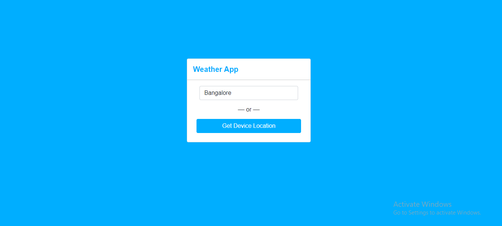
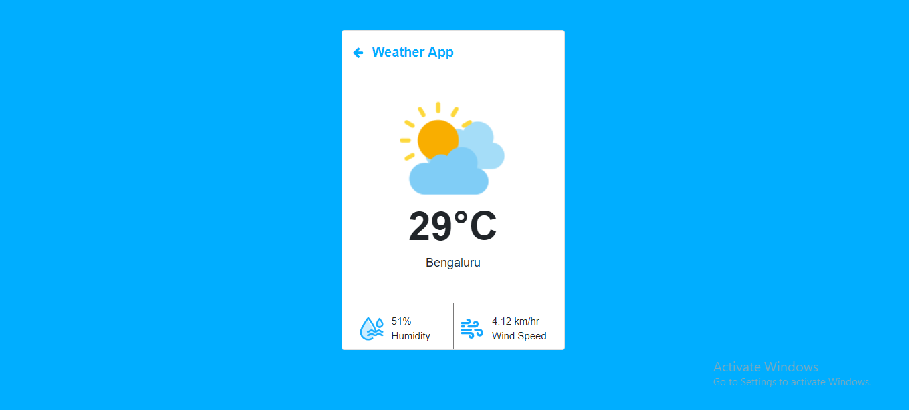
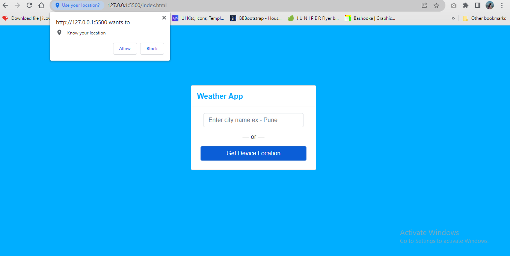
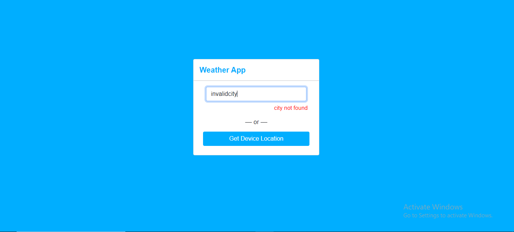
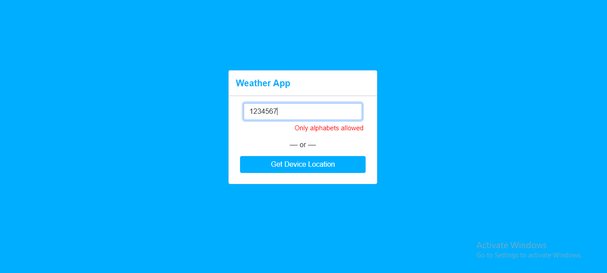
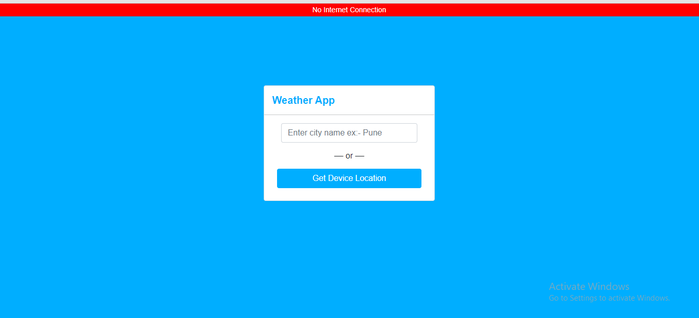
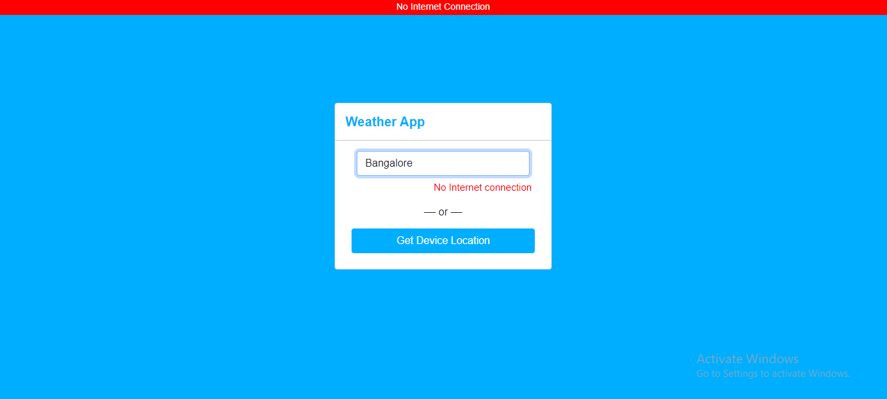

# Weather-App
Get Current weather details based on City or Device location

# About the project

A simple and responsive Weather web app built using **HTML**, **CSS** and **JavaScript**. 
It uses **OpenWeatherMap** API to fetch Temperature, Weather, Humidity & Wind Speed details. 
It gives you current weather condition based on City and Current Device Location.

# ScreenShots

  
  
  
  
  
  
  

# Built With

<ul>
  <li>HTML & CSS</li>
  <li>JavaScript</li>
  <li>OpenWeatherMap API</li>
</ul>

# Installation

To get a local copy up and running, just Clone the repo

git clone https://github.com/Suchita01/Weather-App.git  
and Fire up the Local Development server.

